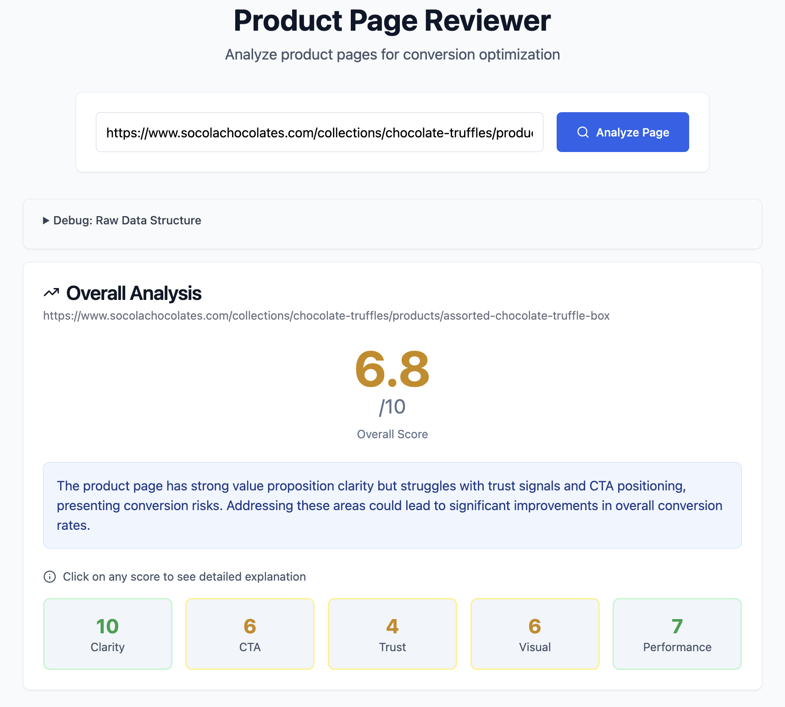

# Product Page Reviewer

Conversion optimization tool that, given a URL, analyzes product pages and provides UI/UX feedback.



## Quick Start

### [Backend]
```bash
cd backend
python -m venv .venv
source .venv/bin/activate  # Windows: .venv\Scripts\activate
pip install -r requirements.txt
echo "OPENAI_API_KEY=your_key_here" > .env
uvicorn main:app --reload --port 8000
```

### [Frontend]
```bash
cd frontend
npm install
npm run dev
```

http://localhost:8001 to use the app.

## API Usage

```bash
# To analyze a product page:
curl -X POST http://localhost:8000/api/analyze \
  -H "Content-Type: application/json" \
  -d '{"url": "https://www.socolachocolates.com/collections/chocolate-truffles/products/assorted-chocolate-truffle-box"}'


# Example response:
{
  "heuristics_data": {
    "site_type": "ecommerce",
    "basic_info": {...},
    "conversion_scores": {...}
  },
  "llm_analysis": {
    "category_scores": {...},
    "suggestions": [...],
    "top_issues": [...]
  }
}
```

## How the Analysis Engine Works

The core of this tool is `heuristic.py` - a sophisticated script that extracts conversion signals from product pages. How it works:

### 1. **Site Type Detection**
First, it analyzes the page content to determine what type of business it is:
- **Ecommerce**: Looks for "add to cart", "checkout", "shipping" keywords
- **SaaS**: Detects "free trial", "pricing", "subscription" patterns  
- **B2B**: Finds "contact sales", "enterprise", "demo" signals
- **Service**: Identifies "book now", "consultation", "quote" terms

This context determines which conversion factors matter most for scoring.

### 2. **Data Extraction**
The engine uses BeautifulSoup to extract 50+ conversion signals across 8 categories:

**Basic Info**: Title, H1, page structure hierarchy
**Pricing**: Price detection (including "free" products), currency handling
**CTAs**: Button text, positioning, proximity to pricing
**Images**: Count, alt text coverage, gallery detection
**Testimonials**: Customer quotes, star ratings, review counts
**Trust Signals**: Security badges, compliance mentions (GDPR, SOC2), guarantees
**Technical**: Page size, scripts, accessibility, SEO elements
**Structure**: DOM depth, sections, navigation patterns

### 3. **Context-Based Scoring**
Each signal gets scored differently based on site type:
- **Ecommerce**: Heavy weight on pricing clarity, shipping info near CTAs
- **SaaS**: Focus on "free trial" CTAs, less penalty for missing explicit pricing
- **B2B**: Emphasizes "contact sales" CTAs, enterprise trust signals

### 4. **Calculating Conversion Score**
The engine calculates 8 weighted scores (0-10 each):
- **Value Proposition Clarity** *(title quality, heading structure, pricing transparency)*
- **CTA Effectiveness** *(button placement, text clarity, urgency signals)*
- **Trust & Social Proof** *(reviews, testimonials, security badges, guarantees)*
- **Visual Imagery** *(image count, alt text coverage, gallery presence)*
- **Mobile & Accessibility** *(viewport, labeled elements, responsive design)*
- **Technical Performance** *(page size, script count, SEO basics)*
- **User Experience** *(form complexity, popup interference, navigation)*
- **Conversion Optimization** *(CTA grouping, page structure, related products)*

These combine into an overall score using weights that adapt to page type (product vs homepage vs category).

### 5. **Fallback Strategy**
When primary detection fails, it cascades through multiple fallback methods:
- If no H1 found → check H2-H6 for product keywords
- If no price found → look for "free" mentions
- If no CTAs found → expand search to include aria-labels and data attributes

Ensures analysis even on poorly structured or unconventional pages.


## Future Improvements (If Granted More Time)

### Scalability
- **Database Integration**: Store analysis history and track improvements over time
- **Batch Processing**: Analyze multiple URLs simultaneously
- **User Accounts**: Save and compare different product pages

### Analysis Depth
- **A/B Testing Integration**: Compare different page versions
- **Competitive Analysis**: Benchmark against similar products
- **Mobile-Specific Insights**: Dedicated mobile UX analysis
- **Accessibility Auditing**: WCAG compliance checking


## Development

### Running Tests
```bash
# Backend tests
cd backend && python test_heuristics.py && test_llm_api.py

# Frontend build
cd frontend && npm run build
```

### Project Structure
```
├── backend/          # FastAPI server
│   ├── main.py      # API endpoints
│   ├── heuristic.py # Analysis engine (50+ heuristics)
│   └── llm.py       # AI integration
└── frontend/         # React app
    ├── src/
    │   ├── App.tsx   # Main component
    │   └── components/ui/  # shadcn components
    └── package.json
```

